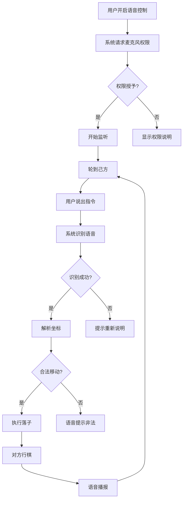

# 语音控制与冥想模式功能设计文档

<!-- Generated by Qoder AI (Model: claude-sonnet-4-5-20250929) - 2025-11-13 -->
<!-- Task: 语音控制和冥想模式功能详细设计方案 -->

## 概述

本文档详细描述四子游戏的两个创新功能：**语音控制**和**冥想模式**。这两个功能旨在提供全新的游戏交互体验，特别适用于可穿戴设备、小屏幕设备以及无障碍辅助场景。

---

## 功能一：语音控制

### 1.1 功能定义

语音控制功能允许玩家通过语音指令控制游戏，同时系统通过语音播报反馈游戏状态。

### 1.2 核心特性

#### 1.2.1 语音落子
- **触发条件**: 用户开启语音控制开关
- **工作时机**: 轮到己方行棋时
- **指令格式**: 支持多种表达方式
  - 传统坐标: "横1竖2"、"横三竖四"
  - 国际式: "A1"、"B2"、"C3"
  - 方向式: "左上"、"右下"、"中间"
  - 自然语言: "移动到中心"、"放在角落"
- **识别语言**: 中文、英文、日文

#### 1.2.2 语音播报
- **播报时机**: 对方（AI或另一玩家）行棋后
- **播报内容**:
  - 落子位置: "对方落子于横2竖3"
  - 吃子事件: "对方吃掉了你的一个棋子"
  - 棋盘状态: "您还剩3个棋子，对方还剩2个棋子"
  - 游戏结果: "恭喜获胜！您吃掉了对方所有棋子"
- **语音特性**: 清晰、自然、速度适中

### 1.3 用户体验设计

#### 1.3.1 UI界面设计
```
┌─────────────────────────────┐
│  [棋盘区域]                 │
│                             │
│  [🎤 语音控制: 开启 ▼]      │
│                             │
│  ┌─────────────────────┐   │
│  │ 🔴 正在监听...       │   │
│  │ 识别结果: "横2竖3"   │   │
│  └─────────────────────┘   │
│                             │
│  [帮助] 支持的语音指令：    │
│  • 横X竖Y (如：横1竖2)      │
│  • A1, B2, C3...            │
│  • 左上、右下、中间         │
└─────────────────────────────┘
```

#### 1.3.2 状态指示器
- **关闭状态**: 🎤 灰色图标
- **监听中**: 🔴 红色闪烁 + "正在监听..."
- **识别中**: ⏳ 黄色 + "正在识别..."
- **识别成功**: ✅ 绿色 + 识别结果文本
- **识别失败**: ❌ 红色 + 错误提示

#### 1.3.3 交互流程


### 1.4 技术实现

#### 1.4.1 依赖库
```yaml
dependencies:
  speech_to_text: ^6.3.0  # 语音识别
  flutter_tts: ^3.8.0      # 语音合成
```

#### 1.4.2 核心服务

**VoiceRecognitionService** (`services/voice_recognition_service.dart`)
```dart
class VoiceRecognitionService {
  // 初始化语音识别
  Future<bool> initialize();
  
  // 开始监听
  Future<void> startListening({
    required Function(String) onResult,
    required Function(String) onError,
  });
  
  // 停止监听
  Future<void> stopListening();
  
  // 检查权限
  Future<bool> hasPermission();
  
  // 设置语言（zh-CN, en-US, ja-JP）
  void setLocale(String locale);
}
```

**VoiceSynthesisService** (`services/voice_synthesis_service.dart`)
```dart
class VoiceSynthesisService {
  // 初始化语音合成
  Future<void> initialize();
  
  // 播报文本
  Future<void> speak(String text, {
    double volume = 1.0,
    double pitch = 1.0,
    double rate = 0.5,
  });
  
  // 停止播报
  Future<void> stop();
  
  // 队列管理
  Future<void> speakQueue(List<String> texts);
  
  // 设置语言
  void setLanguage(String language);
}
```

**VoiceCommandParser** (`ai/voice_command_parser.dart`)
```dart
class VoiceCommandParser {
  // 解析语音指令为Position
  Position? parse(String command);
  
  // 支持的指令格式
  // 1. "横1竖2", "横一竖二"
  // 2. "A1", "B2", "C3", "D4"
  // 3. "左上", "右下", "中间"
  // 4. "移动到横2竖3"
  
  // 模糊匹配和纠错
  List<Position> fuzzyMatch(String command);
}
```

#### 1.4.3 GameBloc扩展

新增事件：
- `VoiceControlToggled`: 切换语音控制开关
- `VoiceCommandReceived(String command)`: 接收到语音指令
- `VoiceAnnouncementRequested(Move move)`: 请求语音播报

新增状态字段：
- `isVoiceControlEnabled: bool`: 语音控制是否开启
- `voiceRecognitionStatus: VoiceStatus`: 语音识别状态
- `lastVoiceCommand: String?`: 最后识别的指令

### 1.5 使用场景

#### 场景1: 手表上游戏
> 用户在智能手表上启动游戏，开启语音控制，通过说"横2竖2"完成落子，听到"对方落子于横3竖2"的播报后继续游戏。

#### 场景2: 运动时娱乐
> 用户在跑步时，通过蓝牙耳机听语音播报，用语音指令下棋，既娱乐又锻炼大脑。

#### 场景3: 无障碍辅助
> 视觉障碍用户通过语音播报了解棋盘状态，用语音指令进行游戏，享受棋类游戏的乐趣。

---

## 功能二：冥想模式

### 2.1 功能定义

冥想模式是基于语音控制的进阶功能，提供完全无屏幕的纯语音对弈体验。用户在整个游戏过程中完全不看屏幕，仅通过听觉和语音完成对弈。

### 2.2 核心理念

- **脱离屏幕**: 屏幕完全黑屏或仅显示极简文字
- **全程语音**: 从开局到结束，所有信息通过语音交互
- **记忆挑战**: 需在脑海中构建和维护完整的棋盘状态
- **复古体验**: 类似早期文字冒险游戏的独特风格
- **认知训练**: 锻炼空间记忆、逻辑推理、专注力

### 2.3 交互流程设计

#### 2.3.1 开局引导
```
系统: "欢迎进入冥想模式"
系统: "您执黑方，先手行棋"
系统: "您的4个黑棋初始位于："
系统: "横1竖1, 横2竖1, 横3竖1, 横4竖1"
系统: "对方的4个白棋初始位于："
系统: "横1竖4, 横2竖4, 横3竖4, 横4竖4"
系统: "请说出您要移动的棋子位置和目标位置"
```

#### 2.3.2 行棋过程
```
用户: "将横2竖1移动到横2竖2"
系统: "落子成功"
系统: "您的棋子位于横2竖2"
系统: "当前您的棋子分布："
系统: "横1竖1, 横2竖2, 横3竖1, 横4竖1"
系统: "对方正在思考..."
系统: [3秒后]
系统: "对方将横2竖4移动到横2竖3"
系统: "对方棋子当前分布："
系统: "横1竖4, 横2竖3, 横3竖4, 横4竖4"
系统: "轮到您行棋"
```

#### 2.3.3 状态查询
```
用户: "我的棋子在哪里？"
系统: "您的4个棋子分别位于："
系统: "横1竖1, 横2竖2, 横3竖3, 横4竖1"

用户: "还剩几个棋子？"
系统: "您还剩4个棋子，对方还剩4个棋子"

用户: "可以移动到哪里？"
系统: "横1竖1的棋子可以移动到横1竖2或横2竖1"
系统: "横2竖2的棋子可以移动到横1竖2, 横2竖1, 横2竖3, 横3竖2"
```

#### 2.3.4 吃子事件
```
系统: "恭喜！您形成了三子连线"
系统: "您吃掉了对方位于横4竖3的棋子"
系统: "当前您还剩4个棋子，对方还剩3个棋子"
```

#### 2.3.5 游戏结束
```
系统: "恭喜获胜！"
系统: "您吃掉了对方所有棋子"
系统: "本局用时5分32秒"
系统: "总共走了24步"
系统: "是否开始新的一局？请说'开始新游戏'或'退出冥想模式'"
```

### 2.4 用户体验设计

#### 2.4.1 UI界面（极简版）
```
┌─────────────────────────────┐
│                             │
│                             │
│         🧘 冥想模式          │
│                             │
│     正在监听您的指令...      │
│                             │
│    [识别结果: 横2竖2]        │
│                             │
│                             │
│                             │
│  (长按屏幕3秒紧急退出)       │
│                             │
└─────────────────────────────┘
```

#### 2.4.2 语音反馈策略

**详细播报原则**:
- 每步后播报完整棋盘状态（可选简化版）
- 明确区分己方和对方棋子
- 播报吃子事件和剩余棋子数
- 提供可用移动提示

**播报优化**:
- 语速适中（0.5倍速）
- 音量适当，清晰可辨
- 重要信息重复播报
- 支持播报暂停/继续

### 2.5 技术实现

#### 2.5.1 MeditationModeBloc

```dart
class MeditationModeBloc extends Bloc<MeditationModeEvent, MeditationModeState> {
  final VoiceRecognitionService voiceService;
  final VoiceSynthesisService ttsService;
  final GameEngine gameEngine;
  
  // 初始化冥想模式
  Future<void> initialize();
  
  // 处理语音查询
  Future<void> handleQuery(String query);
  
  // 播报棋盘状态
  Future<void> announceBoardState();
  
  // 播报可用移动
  Future<void> announceAvailableMoves();
  
  // 播报游戏结果
  Future<void> announceGameResult();
}
```

#### 2.5.2 查询指令支持

| 用户指令 | 系统响应 |
|---------|---------|
| "我的棋子在哪里" | 播报己方所有棋子位置 |
| "对方棋子在哪里" | 播报对方所有棋子位置 |
| "还剩几个棋子" | 播报双方剩余棋子数 |
| "可以移动到哪里" | 播报所有可用移动 |
| "重复一遍" | 重复上次播报内容 |
| "暂停播报" | 暂停语音播报 |
| "继续" | 恢复语音播报 |
| "退出冥想模式" | 退出到普通游戏界面 |

#### 2.5.3 MeditationGamePage

```dart
class MeditationGamePage extends StatelessWidget {
  @override
  Widget build(BuildContext context) {
    return Scaffold(
      backgroundColor: Colors.black, // 纯黑背景
      body: GestureDetector(
        onLongPress: _handleEmergencyExit,
        child: Center(
          child: Column(
            mainAxisAlignment: MainAxisAlignment.center,
            children: [
              Icon(Icons.self_improvement, size: 80, color: Colors.white30),
              SizedBox(height: 20),
              Text(
                '冥想模式',
                style: TextStyle(fontSize: 32, color: Colors.white70),
              ),
              SizedBox(height: 40),
              Text(
                _recognitionStatus,
                style: TextStyle(fontSize: 18, color: Colors.white54),
              ),
              SizedBox(height: 20),
              Text(
                '识别结果: $_lastCommand',
                style: TextStyle(fontSize: 24, color: Colors.greenAccent),
              ),
            ],
          ),
        ),
      ),
    );
  }
}
```

### 2.6 使用场景

#### 场景1: 智能手环
> 用户在智能手环（屏幕仅1.5寸）上无法正常显示完整棋盘，启动冥想模式后，完全通过语音进行游戏，屏幕仅显示"冥想模式"文字。

#### 场景2: 睡前放松
> 用户睡前躺在床上，关闭灯光，通过冥想模式与AI对弈，既放松又锻炼大脑。

#### 场景3: 认知训练
> 专注力训练：用户通过冥想模式锻炼空间记忆能力，提升逻辑思维和专注力。

---

## 开发计划

### 阶段1: 语音基础服务 (12小时)

**Sprint 3V-1: 语音识别与合成基础**

| 任务 | 工作量 | 优先级 |
|-----|-------|--------|
| 集成 speech_to_text 插件 | 2小时 | P0 |
| 配置平台权限（Android/iOS） | 1小时 | P0 |
| 实现 VoiceRecognitionService | 1小时 | P0 |
| 集成 flutter_tts 插件 | 2小时 | P0 |
| 实现 VoiceSynthesisService | 1小时 | P0 |
| 配置多语言支持 | 1小时 | P1 |
| 开发 VoiceCommandParser | 3小时 | P0 |
| 单元测试（20+用例） | 1小时 | P1 |

**交付物**:
- ✅ 语音识别准确率 ≥ 85%
- ✅ 语音播报清晰流畅
- ✅ 支持中/英/日三种语言
- ✅ 指令解析支持多种表达方式

### 阶段2: 游戏集成 (10小时)

**Sprint 3V-2: 语音控制游戏集成**

| 任务 | 工作量 | 优先级 |
|-----|-------|--------|
| 扩展 GameBloc 添加语音事件 | 3小时 | P0 |
| 开发语音控制UI组件 | 4小时 | P0 |
| 实现对方落子语音播报 | 2小时 | P0 |
| 适配手表小屏幕 | 1小时 | P1 |

**交付物**:
- ✅ 语音控制开关正常工作
- ✅ 己方可通过语音落子
- ✅ 对方行棋实时语音播报
- ✅ 兼容双人和人机对战

### 阶段3: 冥想模式 (10小时)

**Sprint 3V-3: 冥想模式实现**

| 任务 | 工作量 | 优先级 |
|-----|-------|--------|
| 开发 MeditationModeBloc | 4小时 | P0 |
| 创建 MeditationGamePage | 2小时 | P0 |
| 实现完整语音引导流程 | 2小时 | P0 |
| 开发棋盘状态查询功能 | 1小时 | P0 |
| 优化语音反馈体验 | 1小时 | P1 |

**交付物**:
- ✅ 完全无屏幕可完成对弈
- ✅ 语音引导清晰易懂
- ✅ 棋盘状态播报准确
- ✅ 支持智能手环设备
- ✅ 良好的无障碍体验

---

## 预期效果

### 性能指标
- 语音识别准确率: ≥ 85%
- 语音识别响应时间: < 500ms
- 语音播报延迟: < 200ms
- 内存占用增加: < 20MB

### 用户体验指标
- 语音指令成功率: ≥ 90%
- 用户满意度: ≥ 4.5/5.0
- 无障碍评分: AAA级

### 技术亮点
1. ✨ 创新的纯语音对弈体验
2. 🔓 突破屏幕尺寸限制
3. 🧠 锻炼空间记忆能力
4. ♿ 优秀的无障碍支持
5. 🌍 多语言国际化支持

---

## 测试计划

### 单元测试
- VoiceCommandParser 解析器测试（20+用例）
- VoiceRecognitionService 模拟测试
- VoiceSynthesisService 模拟测试
- MeditationModeBloc 状态转换测试

### 集成测试
- 语音控制完整流程测试
- 冥想模式完整对弈测试
- 多语言切换测试

### 设备测试
- Android手机（小米、华为、OPPO）
- iOS设备（iPhone、iPad）
- Wear OS手表（小米手表、OPPO Watch）
- 智能手环（超小屏幕设备）

### 无障碍测试
- TalkBack兼容性测试（Android）
- VoiceOver兼容性测试（iOS）
- 视觉障碍用户实际使用测试

---

## 风险评估与应对

### 风险1: 语音识别准确率不足
**应对措施**:
- 提供多种指令格式支持
- 实现模糊匹配和纠错机制
- 显示识别结果供用户确认
- 支持手动输入作为备用方案

### 风险2: 不同设备麦克风质量差异
**应对措施**:
- 调整识别灵敏度
- 提供噪音过滤选项
- 建议用户在安静环境使用

### 风险3: 冥想模式认知负担过大
**应对措施**:
- 提供详细的语音引导
- 支持随时查询棋盘状态
- 提供简化播报选项
- 设置难度级别（只与简单AI对战）

### 风险4: 多语言TTS质量不一致
**应对措施**:
- 测试各语言TTS效果
- 允许用户选择TTS引擎
- 调整语速、音调参数

---

## 后续优化方向

### 短期优化（1-2个月）
- 📊 收集用户反馈数据
- 🎯 优化语音识别准确率
- 🎨 美化UI界面
- 📱 适配更多设备

### 中期优化（3-6个月）
- 🤖 AI语音助手集成（如Siri、Google Assistant）
- 🌐 云端语音识别服务
- 🎵 背景音乐与语音播报协同
- 📈 语音对弈数据分析

### 长期愿景（6个月以上）
- 🏆 语音对弈排行榜
- 🎓 语音教学模式
- 👥 多人语音对战房间
- 🌍 语音解说直播功能

---

## 参考资料

- [speech_to_text 官方文档](https://pub.dev/packages/speech_to_text)
- [flutter_tts 官方文档](https://pub.dev/packages/flutter_tts)
- [Material Design - 无障碍设计](https://material.io/design/usability/accessibility.html)
- [Wear OS 设计指南](https://developer.android.com/training/wearables/design)
- [iOS 无障碍开发指南](https://developer.apple.com/accessibility/)

---

**文档版本**: v1.0  
**最后更新**: 2025-11-13  
**维护者**: Qoder AI  
**相关文档**: `IMPLEMENTATION_PLAN.md`, `QUICK_START_GUIDE.md`, `README.md`
