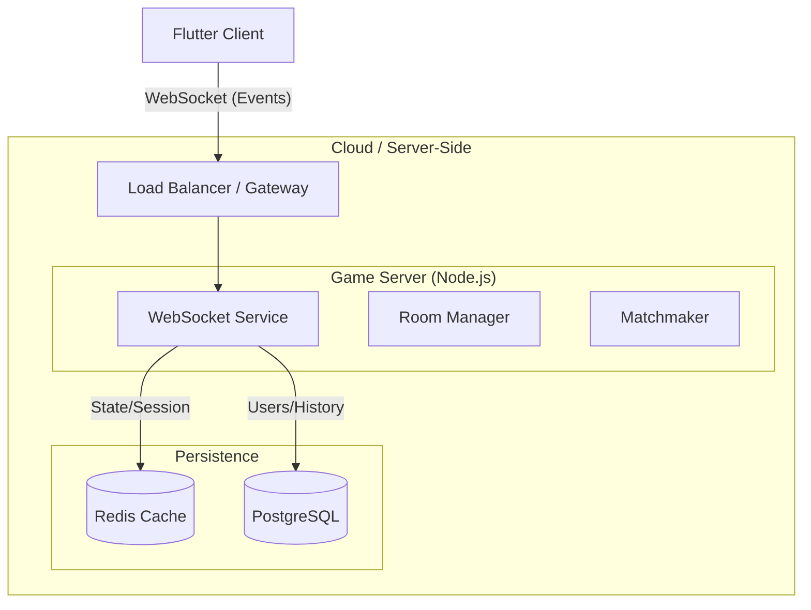

# 服务端架构设计与技术选型报告

**日期**: 2026-01-14
**相关任务**: Server Architecture Design

## 1. 核心需求分析
为了支持 Foursquare 从单机进化为联机游戏，服务端需满足：
1.  **实时通信**: 低延迟的移动同步 (WebSocket)。
2.  **状态管理**: 权威的房间与对局状态维护 (防止本地作弊)。
3.  **扩展性**: 支持未来"动物大乱斗"的复杂逻辑。
4.  **成本控制**: 优先利用免费额度或低资源占用的方案。

---

## 2. 技术选型 (Tech Stack Selection)

基于"低成本"和"本地Docker调试"的约束，我们对比了以下方案：

### 2.1 编程语言与框架
| 方案 | 语言 | 框架 | 优势 | 劣势 | 推荐指数 |
| :--- | :--- | :--- | :--- | :--- | :--- |
| **A** | **Node.js** | **Socket.io** | 生态最丰富，Socket.io自带房间/重连管理，冷启动快，内存占用低。 | 需要为 TS 和 Dart 维护两套数据模型。 | ⭐⭐⭐⭐⭐ |
| **B** | Dart | Serverpod | 可直接复用 Flutter 的 Model 代码；全栈 Dart 体验。 | 相对较重，冷启动慢，对服务器资源要求略高。 | ⭐⭐⭐⭐ |
| **C** | Go | Gin + Gorilla | 性能极致，并发强。 | 开发效率低于 Node/Dart，对于轻量级游戏略显做重了。 | ⭐⭐⭐ |

**✅ 最终选择: Node.js (TypeScript) + Socket.io**
*   **理由**: Socket.io 是实现实时游戏房间逻辑的事实标准，开发极快。Node.js 容器非常轻量 (50-100MB RAM)，非常适合部署在 Fly.io / Render 的免费层。

### 2.2 数据库 (Storage)
| 类型 | 选型 | 方案 | 理由 |
| :--- | :--- | :--- | :--- |
| **关系型数据库** | **PostgreSQL** | **Supabase (Free Tier)** | 提供 500MB 免费存储，自带 REST API 和 Auth 系统，极其节省后端开发工作。 |
| **缓存/会话** | **Redis** | **Docker / Upstash** | 用于存储瞬时的房间状态和 WebSocket 会话。本地用 Docker，线上可用 Upstash Free Tier。 |

### 2.3 基础设施 (Infra)
*   **容器化**: Docker + Docker Compose (本地开发/部署标准)。
*   **部署平台目标**: Render (Free Web Service) 或 Fly.io (Free microVM)。

---

## 3. 系统架构设计 (Architecture)

### 3.1 核心模块
1.  **Gateway Service**: 处理 WebSocket 握手，鉴权 (JWT)。
2.  **Room Manager**: 
    -   管理 `MatchID` <-> `SocketID` 的映射。
    -   处理玩家断线后的"幽灵状态" (允许60秒重连)。
3.  **Matchmaker**: 
    -   维护两个匹配队列：`StandardQueue` (标准) 和 `RankedQueue` (排位)。
    -   每 5秒 轮询一次队列进行配对。

---

## 4. 数据交互协议 (Protocol)
虽然语言不同，但我们将严格遵循 JSON Schema 交互。

*   **Server -> Client**:
    *   `MATCH_START`: `{ matchId, opponent, color, state }`
    *   `OPPONENT_MOVE`: `{ from, to, captured }`
    *   `GAME_OVER`: `{ winner, reason, stats }`
*   **Client -> Server**:
    *   `FIND_MATCH`: `{ mode: "rank" }`
    *   `SUBMIT_MOVE`: `{ matchId, from, to }`

---

## 5. 成本预算 (Cost Analysis)

| 组件 | 服务商 | 方案 | 预计费用 |
| :--- | :--- | :--- | :--- |
| **App Server** | Render / Fly.io | Free Tier (512MB RAM) | **$0 / mo** |
| **Database** | Supabase | Free Tier (500MB) | **$0 / mo** |
| **Redis** | Upstash | Free Tier (10k req/day) | **$0 / mo** |
| **Total** | | | **$0 / mo** (起步阶段) |

---

## 6. 实施路线图
1.  **Day 1**: 初始化 `server/` 目录，配置 `package.json` (Express, Socket.io, TypeScript) 和 `docker-compose.yml`。
2.  **Day 2**: 实现基础通信 (Echo)，联调 Flutter 客户端的 `WebSocketService`。
3.  **Day 3**: 实现简单的内存房间逻辑和匹配。
